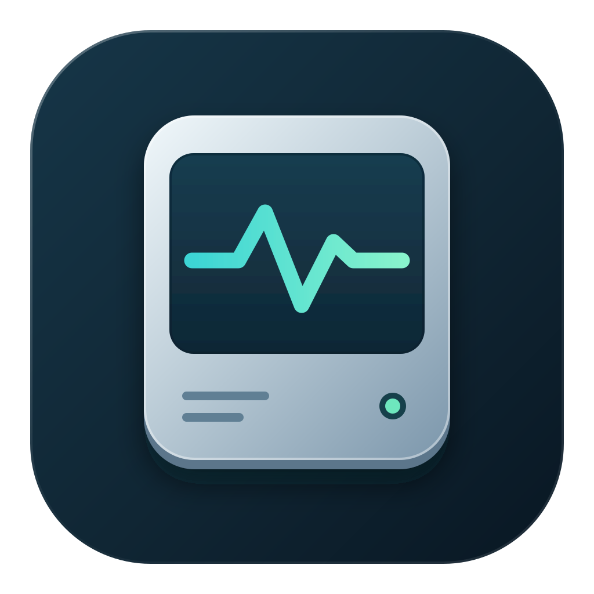
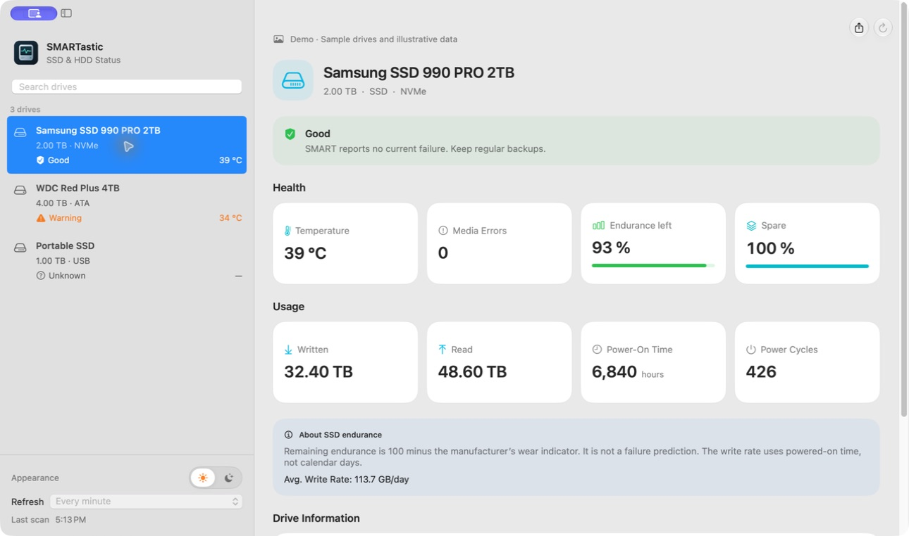
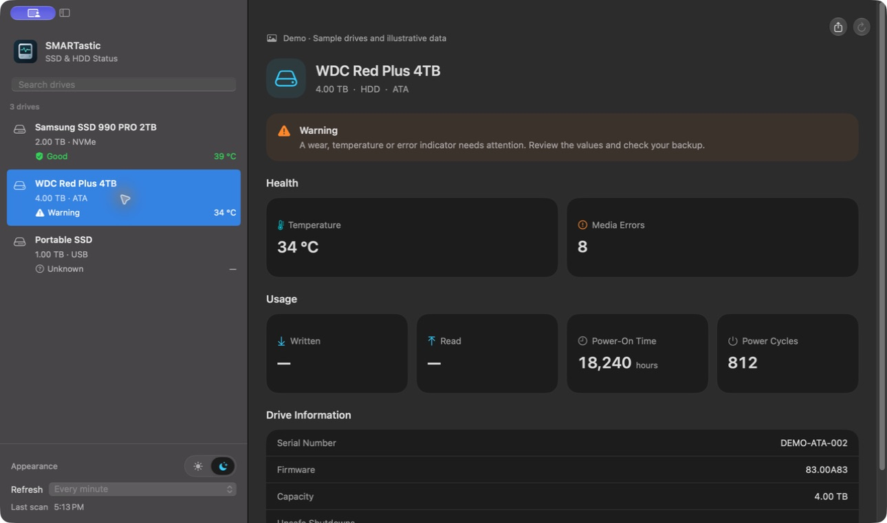
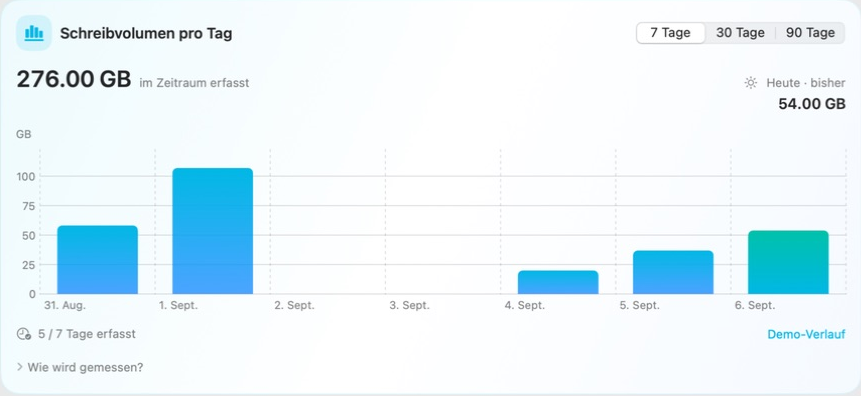

<p align="center"></p>

# SMARTastic

A native macOS app for understanding the health of your SSDs and hard drives.
Built with SwiftUI, powered by [smartmontools](https://www.smartmontools.org/),
and developed by [Robin Bially](https://github.com/RobinBially).

<p>
  
  
  
</p>

<picture>
  <source media="(prefers-color-scheme: dark)" srcset="assets/screenshot-dark.png">
  
</picture>

*Actual app screenshots, using clearly labelled synthetic demo data.*

## What it shows

- **Internal and external drives**, including Apple SSDs, NVMe drives and ATA disks.
- **Clear health states:** good, warning, critical or unknown. Failed SMART status,
  NVMe critical warnings and depleted endurance are never hidden by a green score.
- **Available measurements:** temperature, rated endurance, spare capacity,
  media/sector error counters, data read/written, power-on hours and power cycles.
- **Daily write history:** a native bar chart for 7, 30 or 90 days, with a today
  summary and selectable bars. Uses real timestamps and counter differences,
  independently of SMART power-on hours.
- **Drive search** by model or interface, with native keyboard selection.
- **Refresh controls:** native segments for pause/manual, every 30 seconds,
  every minute (default), or every five minutes. The last successful scan time stays visible.
- **JSON report export** with a versioned schema and measurement timestamp.
  Serial-number fields are omitted; review diagnostic text before sharing.
- **Read diagnostics** and useful guidance when smartmontools or SMART access is
  unavailable. A failed scan preserves the previous snapshot and shows a warning.
- **Compact layout and native circular actions**, with content scrolling beneath
  the transparent window header.
- **A sun/moon appearance switch**, with system appearance by default (right-click
  the switch to restore it), plus English, German, French, Spanish and
  Simplified Chinese translations selected from your system preferences.



## Daily write history

<picture>
  <source media="(prefers-color-scheme: dark)" srcset="assets/history-dark.png">
  
</picture>


History starts when this version first scans a drive. SMART only exposes a lifetime
counter; it cannot reconstruct earlier daily usage. Keep SMARTastic open with
periodic refresh enabled to collect regular measurements. There is no background
agent when the app is quit. ⌘W minimizes the window so measurement can continue;
⌘Q quits the app. The standard ⌘M shortcut also remains available.

The chart shows measured GB, not extrapolated full-day totals. Missing days stay
empty; an observed zero is shown as a dot. Today's value and other partially
observed days are incomplete. Select a bar to see its measured amount and covered
hours. Hover over the chart for a floating daily detail card, including explicit
missing-data messages. Click to pin a day; click it again to clear the selection.
Buttons and period controls include contextual tooltips. Short intervals crossing midnight (up to 10 minutes) are split in proportion
to elapsed time. Longer intervals crossing days are reported separately rather
than assigned to invented daily totals. Their entire volume is reported if the
interval overlaps the selected period, so it may include writes outside that period.

Up to 90 calendar days are kept locally in
`~/Library/Application Support/SMARTastic/write-history.json`. A hash of model and
serial identifies each drive across device-path changes; raw serial numbers are
not stored. Drives without a reliable serial or write counter cannot be tracked.
Counter decreases establish a fresh baseline. The calendar time zone is fixed when
the history is created and displayed under the chart's measurement explanation.
Demo history stays in memory and never enters the real history file. The existing
JSON report exports the current SMART snapshot, not this local history.

## Install

Requires **macOS 14 Sonoma or later** and **smartmontools 7 or later**.
The app supports Apple Silicon and Intel. Homebrew distribution uses the
[LocalFoundry tap](https://github.com/localfoundry/homebrew-tap).

The release pipeline and cask are prepared for version **1.1.0**. Until the first
signed and notarized release is published to the tap, use the source-build steps
below. Do not install an unsigned development build as a trusted public release.

The intended Homebrew command after publication is:

```sh
brew install --cask localfoundry/tap/smartastic
```

The cask also installs smartmontools. For a manual app download from
[GitHub Releases](https://github.com/RobinBially/SMARTastic/releases), install
smartmontools separately:

```sh
brew install smartmontools
```

SMARTastic looks for smartctl at `/opt/homebrew/bin/smartctl` on Apple Silicon
and `/usr/local/bin/smartctl` on Intel. It does not ask for administrator access,
install a privileged helper, start disk self-tests, or change drive settings.

## Understanding the numbers

SMART reports what a drive and its controller expose. USB adapters, RAID
controllers and access permissions can prevent some or all SMART data from being
read. The app still shows the available macOS drive information.

**A dash means unavailable, not zero.** ATA attribute meanings vary by vendor;
unsupported SSD wear and traffic counters are not guessed. For NVMe, one data
unit is 512,000 bytes, and TB/GB use decimal units. ATA error counts aggregate
reported reallocated, pending and offline-uncorrectable counters; categories can
overlap and are not a count of distinct failing sectors.

**Remaining rated endurance is not a lifespan prediction.** It is 100 minus the
manufacturer's wear indicator, clamped at zero. SMART power-on hours can exclude
low-power states. “Written per 24 SMART hours” divides lifetime written bytes by
the drive-reported power-on hours and normalizes to 24 hours. It is not necessarily
a calendar-day average and is not the current write speed. A measured calendar-day
average would require counter differences between timestamped observations.
The calendar lifespan forecast and arbitrary HDD health percentage were removed
because they suggested more certainty than SMART provides. See the [NVMe SMART log field definitions](https://manpages.debian.org/testing/libnvme-dev/nvme_smart_log.2.en.html).

A good SMART result cannot rule out a sudden failure. Keep backups regardless of
the displayed status. SMARTastic makes no network requests; reports are saved
only to the destination you choose.

## Build from source

Use full **Xcode 26.3 or later** and its command-line tools. If the selected
Command Line Tools SDK lacks the SwiftUI macro plugin, select full Xcode or set
`DEVELOPER_DIR` for the build; see [release documentation](docs/RELEASING.md).

```sh
brew install smartmontools
git clone https://github.com/RobinBially/SMARTastic.git
cd SMARTastic
swift test
./scripts/make-app.sh
open .build/app/SMARTastic.app
```

The script creates a release build for the current architecture and signs it ad
hoc for local development. To build both architectures:

```sh
ARCHS="arm64 x86_64" ./scripts/make-app.sh
```

Launch a synthetic demo for screenshots (no drive reads):

```sh
open .build/app/SMARTastic.app --args --demo --light -AppleLanguages '(en)'
# Use the Appearance switch for System, Light or Dark.
```

Build, signing, notarization, release resumption and Homebrew maintenance are
covered in [docs/RELEASING.md](docs/RELEASING.md). The review findings and actual
verification scope are recorded in [docs/REVIEW-1.1.0.md](docs/REVIEW-1.1.0.md).

## License

[MIT](LICENSE).
